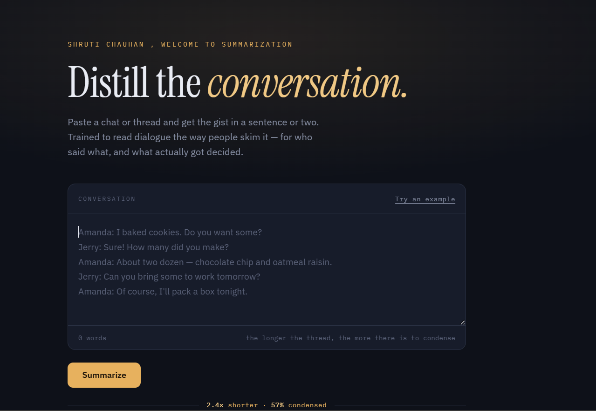
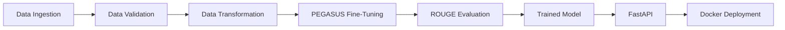

# 📝 Text Summarization Service

### End-to-End NLP & MLOps Pipeline using PEGASUS

> An end-to-end **abstractive text summarization** system built using Google's **PEGASUS Transformer**, with data validation, model fine-tuning, ROUGE evaluation, REST API inference, and Docker-based deployment.

<div align="center">


</div>

---

## 🏗️ Architecture

<div align="center">

</div>



### Pipeline

**Data → Validation → Transformation → Fine-Tuning → Evaluation → API → Deployment**

---

## 🧠 Core Components

### 1. Data Ingestion

Loads the summarization dataset and prepares the required train/validation/test data.

### 2. Data Validation

Checks dataset structure, missing values, and data consistency before training.

### 3. Data Transformation

Cleans the text and uses the **PEGASUS tokenizer** to convert documents and summaries into model-ready inputs.

### 4. Model Training

Fine-tunes the pre-trained **PEGASUS Transformer** for abstractive summarization.

### 5. Evaluation

Generated summaries are evaluated against reference summaries using:

* **ROUGE-1**
* **ROUGE-2**
* **ROUGE-L**

### 6. API Inference

The trained model is exposed through a **FastAPI REST API**.

```http
POST /predict
```

Example request:

```json
{
  "text": "Enter the document or article to summarize..."
}
```

Example response:

```json
{
  "summary": "Generated concise summary..."
}
```

### 7. Docker Deployment

The application is containerized using Docker to provide a reproducible runtime environment.

```bash
docker build -t text-summarizer .
docker run -p 8080:8080 text-summarizer
```

---

## 📁 Project Structure

```text
Text-Summarizer/
│
├── src/
│   ├── components/
│   │   ├── data_ingestion.py
│   │   ├── data_validation.py
│   │   ├── data_transformation.py
│   │   ├── model_trainer.py
│   │   └── model_evaluation.py
│   │
│   ├── pipeline/
│   ├── configuration/
│   └── utils/
│
├── artifacts/
├── config/
├── app.py
├── Dockerfile
├── requirements.txt
└── README.md
```

---

## ⚙️ Tech Stack

| Component  | Technology                          |
| ---------- | ----------------------------------- |
| Language   | Python                              |
| NLP Model  | PEGASUS                             |
| Framework  | Hugging Face Transformers / PyTorch |
| Evaluation | ROUGE                               |
| API        | FastAPI                             |
| Deployment | Docker                              |

---

## ▶️ Run Locally

```bash
git clone <repository-url>
cd Text-Summarizer
pip install -r requirements.txt
python app.py
```

API:

```text
http://localhost:8080
```

---

## 🎯 Key Takeaway

This project demonstrates the complete ML lifecycle:

**Data Engineering → Transformer Fine-Tuning → Evaluation → API Development → Docker Deployment**

It focuses not only on building an NLP model, but on turning the model into a **reusable and deployable ML service**.

---

<div align="center">

**Built with Python • PEGASUS • FastAPI • Docker**

</div>
